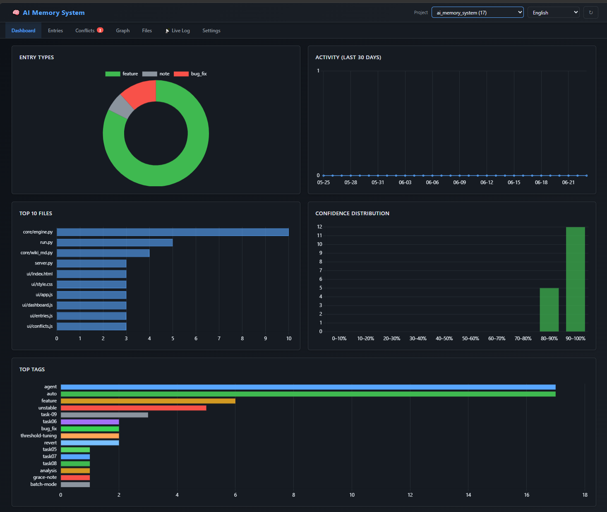
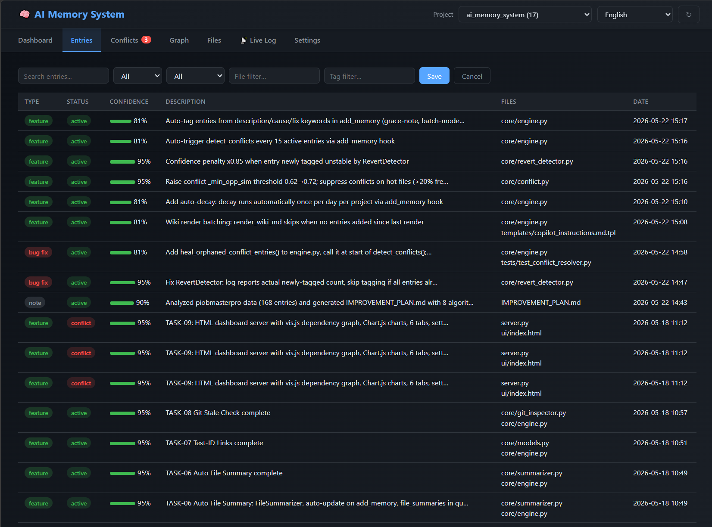
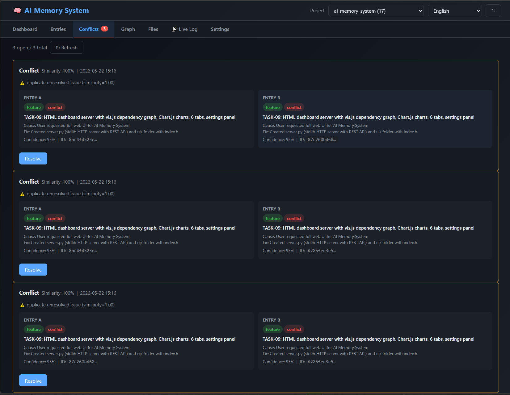
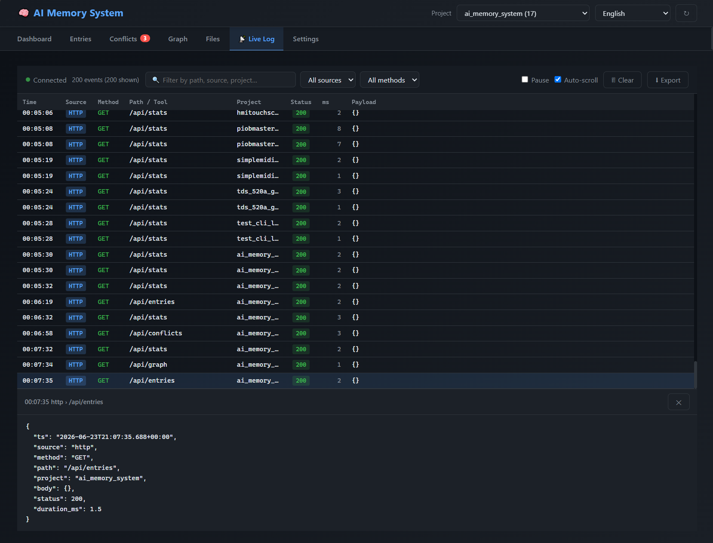
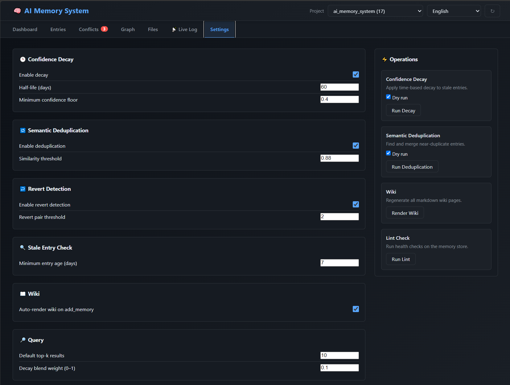
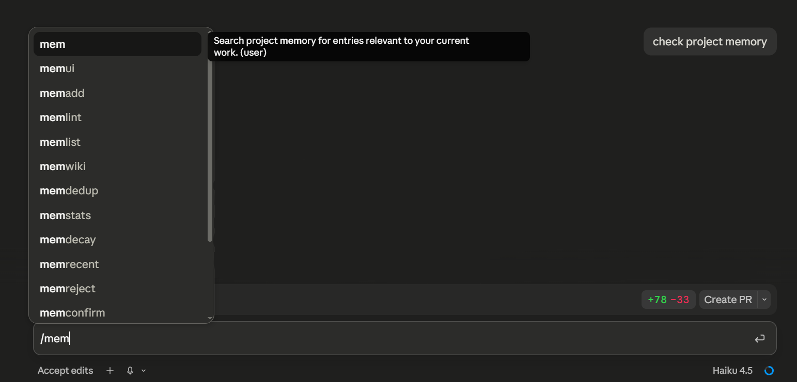

# AI Memory System

A self-contained, local persistent memory engine for software projects — with universal MCP integration for Claude Code, Cursor, VS Code and Visual Studio, SessionStart context injection for both Claude Code and GitHub Copilot Agent, and a responsive web dashboard.

It remembers decisions, tracks bugs and features, detects contradictions between historical entries, renders a structured Markdown wiki, visualises dependency graphs, and automatically feeds that knowledge back into every AI agent session so the agent always has full project context without any manual #file references. The memory maintains itself: confidence decays with project activity, proven-useful entries are reinforced and age slower, churn-prone code gets flagged, stale conflicts are auto-triaged, and duplicates are merged daily. Real-time activity logging with SSE streaming shows all incoming commands (HTTP, MCP, CLI) as they happen.

## Why does this exist?

AI agents start every new chat session with a **blank slate** — no memory of decisions made before, bugs already fixed, or why the code looks the way it does. When tackling a new problem, they routinely break solutions that were carefully built in previous sessions.

**AI Memory System** was created to solve exactly that:

| Problem | Solution |
|---|---|
| Every new chat forgets everything | Full project memory is injected into every new agent session automatically |
| Agents break existing solutions | Each change is stored with cause, fix, and links to related changes — agents see the full picture |
| Git log only shows *what* changed | The system records *why* it changed, *what problem* it solved, and *how it connects* to other decisions |
| Contradictions go unnoticed | Past and present changes are compared; conflicts are detected and surfaced for resolution |

---



---

## How It Works

```
┌──────────────────────────────────┐  ┌──────────────────────────────────────┐
│  VS Code (Copilot Agent mode)    │  │  Claude Code / Cursor / VS 2022+     │
│                                  │  │                                      │
│  SessionStart hook               │  │  mcp_server.py (stdio JSON-RPC 2.0)  │
│    └─► context_injector.py       │  │    7 tools: memory_query, memory_add,│
│        injects memory summary    │  │    memory_confirm, memory_reject,    │
│                                  │  │    memory_recent, memory_conflicts,  │
│  PostToolUse hook                │  │    memory_stats                      │
│    └─► hook_handler.py           │  │                                      │
│        auto-saves memory entry   │  │  .claude SessionStart hook           │
│                                  │  │    └─► context_injector.py --plain   │
│  copilot-instructions.md         │  │        injects memory summary        │
│    └─ instructs agent to record  │  │  /mem* global slash commands         │
└───────────────┬──────────────────┘  └───────────────────┬──────────────────┘
                ▼                                         ▼
        MemoryEngine (core/engine.py) — the single gateway for all writes
        auto-pipeline on every add: conflict detection (capped) · revert
        detection · auto-tagging · function extraction · daily decay ·
        conflict triage · dedup + summary rollup · file summaries · wiki
                ▼
        data/projects/<name>/memory.json    (per-project, isolated)
        data/projects/<name>/wiki/          (Markdown wiki)
```

One installation (e.g. `D:\ai_memory_system`) serves **all** your projects — each with isolated data under `data/projects/<name>/`. The registry `data/connected_projects.json` remembers every connected project so `connect.py --all` can refresh hooks and configs everywhere at once.

## Features

### Capture & recall
- **SessionStart injection** — a relevance-first memory summary (key decisions → high-confidence entries → unstable surfaces → recent activity → open conflicts) is injected into every new agent session, both in VS Code Copilot and in Claude Code; every injection is logged as a *read* so the read/write balance is measurable
- **PostToolUse hook** (VS Code) — deterministically records a memory entry after every file write
- **MCP server** — 7 tools (`memory_query/add/confirm/reject/recent/conflicts/stats`) over stdio JSON-RPC 2.0 for Claude Code, Cursor, VS Code, VS 2022/2026
- **Slash commands** — 15 global `/mem*` commands available in any Claude Code chat
- **Semantic search** — query ranking blends 90% semantic similarity with 10% decayed confidence; ties break by recency

### Trust economy (confidence lifecycle)
- **Type-aware birth confidence** — decision `0.75`, bug_fix/feature `0.60`, note `0.45` (explicit values always respected)
- **Activity-relative decay** — effective age = `min(wall-clock age, newer entries × 3 days)`: a paused project's memory does not rot; half-life 60 days, floor `0.25`, 7-day grace period
- **Decisions age 4× slower** — a decision holds until it is superseded
- **Reinforcement loop** — `memory_confirm`/`memory_reject` raise/lower confidence; the MCP server *auto-reinforces* recalled entries whose files the agent then re-edited (+0.05, the strongest relevance signal available without asking anyone)
- **Usage extends half-life** — `hl_eff = hl × (1 + 0.5 × usage_count)`: proven-useful memories structurally rot slower
- **No compounding** — decay always recomputes from an immutable `confidence_base`, never from an already-decayed value

### Self-maintenance (all automatic, piggy-backed on `add_memory`)
- **Conflict detection** — semantic similarity + heuristics with hot-file discount; burst-capped (max 10 new conflicts per full scan, 3 per single add); full scan every 15 active entries
- **Conflict auto-triage** — stale disputes are auto-dismissed (30+ days with both sides at the floor, or 14+ days when both ≤ 0.35), restoring the entries to `active`; manual `supersede`/`merge`/`dismiss` always available with a full audit trail
- **Orphan healing** — entries stuck in `conflict` status without a matching record are restored to `active`
- **Revert detection (v2)** — flags add/revert churn as `unstable` (×0.85 confidence penalty, floor `0.25`); function-level surface matching with auto-extraction of function names from prose; hotspot guard (many edits ≠ churn) and small-project guard (< 8 distinct files → file overlap carries no signal); the detector is versioned, so algorithm upgrades re-evaluate old tags automatically, and tags expire after 14 quiet days
- **Daily hygiene** — conservative dedup (similarity ≥ 0.97 **and** identical file sets) plus rollup of old session summaries (newest 5 kept)
- **Daily decay** — runs at most once per day per project; operational timestamps survive wiki rebuilds
- **Auto-tagging & function extraction** — keywords and `name()` patterns harvested from description/cause/fix
- **Auto file summaries** — per-file digest regenerated on every `add_memory`

### Storage & integrity
- **Append-first storage** — historical entries are never silently overwritten
- **Atomic JSON writes** with automatic backup before overwrite
- **Activity log** — every change timestamped with action, affected IDs and reason
- **Test-ID links** — warns when superseding entries that have linked tests
- **Git stale check** — flags entries whose referenced files/functions no longer exist in the repo
- **Dependency graph** — `depends_on` / `required_by` links; cycle detection; semantic link suggestions

### Interfaces
- **HTML dashboard** — local web UI with charts, vis.js dependency graph, real-time SSE log, settings form, operations panel, i18n (EN/UK)
- **Markdown wiki** auto-rendered with Obsidian-friendly `[[wikilinks]]`, dirty-checked (no-op when nothing changed)
- **One-command IDE setup** — `connect.py` wires MCP configs + hooks into any IDE; `connect.py --all` refreshes every registered project at once
- **Learner** — analyses Copilot chat logs, extracts patterns, updates managed project instructions
- **Daemon** — background file watcher for non-agent edits (fallback)
- **Multi-project** — data isolated per project under `data/projects/<slug>/`
- **Offline-first embeddings** — `sentence-transformers` when installed, deterministic local hasher otherwise; LRU-cached

---

## Requirements

- Python 3.10+
- No mandatory third-party dependencies (pure stdlib for core functionality)

**Optional** (recommended):

```
pip install sentence-transformers   # higher-quality semantic similarity
pip install watchdog                # efficient file watching (daemon mode)
```

---

## Installation

```powershell
git clone https://github.com/dgimbialo/ai_memory_system.git D:\ai_memory_system
cd D:\ai_memory_system

# (Optional) create venv
python -m venv .venv ; .venv\Scripts\Activate.ps1

# Bootstrap: creates data/ files
python bootstrap.py
```

---

## Quickstart — Memory CLI (`run.py`)

```powershell
# Add a memory entry with dependency and test links
python run.py --project my_app add_memory `
  --type bug_fix `
  --description "Login crashes on empty password" `
  --cause "Missing null-check before bcrypt call" `
  --fix "Added validation in auth.py line 42" `
  --files src/auth.py `
  --confidence 0.9 `
  --tags backend auth `
  --depends-on <prior_decision_id> `
  --test-ids test_login_empty_password

# Semantic search
python run.py --project my_app query_memory "authentication bug"

# Resolve a conflict
python run.py --project my_app resolve_conflict `
  --id <conflict_id> --action supersede_a --reason "B is correct"

# Dependency graph
python run.py --project my_app add_link --from-id <id1> --to-id <id2>
python run.py --project my_app get_dependencies --id <id> --depth 2
python run.py --project my_app suggest_links --id <id> --threshold 0.75

# Maintenance
python run.py --project my_app decay --dry-run
python run.py --project my_app deduplicate --dry-run
python run.py --project my_app check_stale --repo-path C:\Projects\MyApp
python run.py --project my_app render_wiki
python run.py --project my_app lint
```

> Omit `--project` to use the default shared store (`data/`).

### All `run.py` commands

| Command | Description |
|---|---|
| `add_memory` | Add entry (`--type`, `--description`, `--cause`, `--fix`, `--files`, `--confidence`, `--tags`, `--depends-on`, `--test-ids`) |
| `session_summary` | Create one summary entry aggregating recent session work (old summaries auto-roll up, newest 5 kept) |
| `list_memory` | List entries (filter: `--type`, `--status`) |
| `query_memory` | Top-k semantic search (decay-aware ranking, recency tiebreak) |
| `update_status` | Change entry status (logged) |
| `update_confidence` | Change entry confidence (logged; also resets the decay baseline) |
| `reinforce` | Confirm a memory: raise confidence, count the use, reset the decay clock |
| `weaken` | Reject a memory: lower confidence toward the floor |
| `detect_conflicts` | Full conflict re-scan (burst-capped at 10 new conflicts per scan) |
| `list_conflicts` | List unresolved conflicts with full entry details |
| `resolve_conflict` | Resolve conflict: `--id`, `--action supersede_a\|supersede_b\|merge\|dismiss`, `--reason` |
| `triage_conflicts` | Auto-dismiss stale conflicts (old + both sides decayed; `--max-age-days`, `--dry-run` / `--apply`) |
| `decay` | Apply confidence decay (`--half-life-days`, `--min-confidence`, `--dry-run` / `--apply`) |
| `decay_preview` | Read-only preview of effective (decayed) confidence for all entries |
| `deduplicate` | Find and merge near-duplicates (`--threshold`, `--dry-run` / `--apply`) |
| `find_duplicates` | List duplicate clusters (read-only alias for `deduplicate --dry-run`) |
| `stabilize_unstable` | Remove `unstable` tags from surfaces with no revert activity for N days |
| `recompute_unstable` | Re-evaluate all `unstable` tags with the current detector, clear stale ones |
| `add_link` | Create a `depends_on` link (`--from-id`, `--to-id`) |
| `remove_link` | Remove a dependency link |
| `get_dependencies` | Show transitive dependencies (`--id`, `--depth`) |
| `suggest_links` | Suggest links by semantic similarity (`--id`, `--threshold`, `--top-k`) |
| `summarize_file` | Print auto-generated file summary |
| `check_stale` | Flag entries whose referenced files/functions no longer exist in the repo (`--repo-path`, `--dry-run` / `--apply`) |
| `update_instructions` | Generate Learned Patterns from high-confidence decisions into copilot-instructions.md |
| `render_wiki` | Render Markdown wiki under `data/…/wiki/` |
| `lint` | 7 health checks: stale, low-confidence, orphans, duplicates… |
| `state` | Entry count, conflicts, wiki, embedding backend |

---

## HTML Dashboard — `server.py`

A lightweight, beautiful single-page web UI served entirely on localhost — no npm, no build step, no external dependencies.

```powershell
python server.py --project piobmasterpro
# opens http://localhost:5001 automatically

python server.py --project my_app --port 8080 --no-browser
```

### UI/Design Highlights

- **Modern dark theme** — GitHub-inspired with accent blues, greens, and reds for status indicators
- **Responsive layout** — grid-based design that scales from narrow to ultra-wide displays
- **Large, readable charts** — 320px height on 2-column grid for clarity; KPI cards with hover effects
- **Polished interactions** — smooth transitions, shadows, gradients on header/footer, hover animations
- **Accessibility** — high contrast, readable fonts, semantic HTML, keyboard navigation
- **Internationalization** — English / Ukrainian toggle in header, all strings translatable

### Tabs

| Tab | Contents |
|---|---|
| **Dashboard** | 9 KPI cards (totals by type, avg confidence, open conflicts, linked entries, active entries, **Reads / Writes** loop-health ratio) + 6 large Chart.js visualizations: entry types, activity timeline, top files, confidence histogram, top tags, status breakdown. |
| **Entries** | Filterable, searchable table; click any row for an expandable detail pane with inline editing of status, confidence and tags. |
| **Conflicts** | Side-by-side conflict comparison cards with supersede/merge/dismiss actions, reason dialog, and full audit trail. Auto-detection, auto-triage and manual resolution all supported. |
| **Graph** | Interactive vis.js dependency graph — nodes colored by entry type, sized by confidence. Filter controls, pan/zoom, detail view, suggest related entries. |
| **Files** | File list with per-file entry badges; click to expand auto-summary digest + all related memory entries. |
| **Live Log** | Real-time SSE stream of ALL incoming commands (HTTP, MCP, CLI) with millisecond timestamps. Filter by text/source/method, pause/resume, auto-scroll, click any row for a full JSON detail drawer. Export as JSON. |
| **Settings** | Configuration form for decay (half-life, floor), deduplication threshold, revert detection, query defaults and default tags. Operations panel: one-click decay, dedup, wiki render, lint. |

The projects dropdown hides empty stores automatically (test artifacts, slug typos); a store reappears with its first entry.

### Screenshots

**Entries** — filterable table with confidence bars, inline editing and detail pane:



**Conflicts** — side-by-side comparison with one-click resolution:



**Live Log** — real-time SSE stream of every incoming command, with a JSON detail drawer:



**Settings** — full configuration form plus one-click operations panel:



Language switcher (EN / UK) in the top-right corner — strings sourced from `ui/translations.js`.

### Performance & Stability

- **ThreadingHTTPServer** — thread pool for efficient request handling, not a thread per request
- **SSE client limits** — max 20 concurrent log streams to prevent resource exhaustion
- **Graceful queue overflow** — slow clients are dropped, not allowed to block the server
- **Real-time activity log** — 500-event ring buffer with no memory leaks
- **Keepalive streams** — 25-second timeout + periodic pings to detect dropped connections

---

## MCP Integration — Claude Code, Cursor, VS Code, Visual Studio

The system exposes a universal **Model Context Protocol (MCP)** server that works with any AI agent that supports the MCP standard:

### Supported IDEs

- **Claude Code** — native MCP support
- **Cursor** — native MCP support  
- **VS Code** with Copilot / Continue / any MCP client
- **Visual Studio 2022 (17.13+)** and **VS 2026 (18.x)** with Copilot Chat
- **Cline**, **Aider**, and any other MCP-compatible tool

### One-Command Setup

```powershell
cd C:\Path\To\Your\Project
python D:\ai_memory_system\connect.py

# Force specific IDE(s):
python D:\ai_memory_system\connect.py --ide claude --ide vs

# Refresh hooks/configs for EVERY previously connected project:
python D:\ai_memory_system\connect.py --all
```

This creates/updates:
- `.mcp.json` — Claude Code + VS 2022/2026 config (both `mcpServers` and `servers` keys)
- `.claude/settings.json` — Claude Code **SessionStart hook** (memory summary injected into every new session)
- `.cursor/mcp.json` — Cursor config
- `.vscode/mcp.json` — VS Code config
- `%APPDATA%\Microsoft\VisualStudio\globalMcpServers.json` — VS global config (applies to all solutions)
- `.github/copilot-instructions.md` — Copilot Chat context with memory workflow

Every connect registers the project in `data/connected_projects.json`, so a later `connect.py --all` upgrades all of them in one go. All config writes are merges — idempotent and safe to re-run.

Then **reload your IDE** — the agent now has 7 memory tools available.

### The feedback loop, closed automatically

- Every `memory_query` resets the decay clock of the entries it surfaced (`last_used`)
- When the agent later saves a memory whose files overlap a previously recalled entry, that entry is **auto-reinforced** (+0.05): recall that demonstrably informed real work is the strongest relevance signal there is
- A `bug_fix` saved without a root cause gets a gentle nudge in the tool response — the cause is what makes the memory valuable when the bug resurfaces
- `memory_stats` warns when the current project lacks the SessionStart hook

### MCP Tools (Slash Commands in Claude Code)

Inside any agent chat, use these slash commands:

| Command | Purpose |
|---|---|
| `/mem <query>` | Semantic search over project memory (top 8 results) |
| `/memadd <type> <desc>` | Record a memory entry (bug_fix, feature, decision, note) |
| `/memrecent [--n N]` | List most recent N entries |
| `/memconfirm <id>` | Reinforce (↑ confidence) an entry that proved correct |
| `/memreject <id>` | Weaken (↓ confidence) an entry that was wrong |
| `/memconflicts` | Show unresolved conflicts |
| `/memstats` | Store health summary |
| `/memlist [--type] [--status]` | Filter entries by type/status |
| `/memdecay [--apply]` | Apply confidence decay (dry-run or apply) |
| `/memdedup [--apply]` | Find and merge near-duplicates |
| `/memrecompute [--apply]` | Re-evaluate unstable tags |
| `/memlint` | Run health checks |
| `/memwiki` | Render Markdown wiki |
| `/memui [--port N]` | Launch web dashboard |
| `/memsession` | Create a session summary |

All commands work **offline** — no external APIs, pure local Python + embeddings.

The `/mem*` commands autocomplete right in the Claude Code chat:



**Example**: Ask the agent to "check project memory for async patterns" and it will automatically call `/mem async patterns`, surface relevant past decisions, and use that context for the current task.

---

## VS Code + Copilot Integration (`run_infra.py`)

### 1. Scaffold a project

```powershell
python run_infra.py setup C:\Projects\MyApp `
  --language python `
  --framework django
```

Creates inside `C:\Projects\MyApp`:
```
.github/
  copilot-instructions.md   ← project standards + Agent Workflow section
  hooks/
    memory.json             ← SessionStart + PostToolUse hooks
  prompts/
    record-memory.prompt.md ← /record-memory slash-command
.vscode/
  settings.json
  extensions.json
```

### 2. The hooks (automatic, zero-effort)

**`SessionStart`** → `core/context_injector.py`

At the start of every agent session (VS Code hook protocol, or `--format plain` for the Claude Code hook), the agent receives a relevance-first summary — durable knowledge before recency:
```
## Project Memory — my_app  (2026-09-15 10:08 UTC)
### Key Decisions
- [aa11bb22] (decision, conf=0.75, active) Use PostgreSQL for the primary store → db/schema.sql [2026-08-02]
### High-Confidence Memories
- [abc12345] (bug_fix, conf=0.90, active) Login crashes on empty password → src/auth.py [2026-09-10]
### ⚠ Unstable / Churn-Prone (avoid re-litigating)
- attachGraceNotes  (3 add/revert-tagged entries)
### Recent Activity
- [ff00aa11] (feature, conf=0.60, active) Add rate limiting to login endpoint → src/auth.py [2026-09-14]
### Open Conflicts (1)
- abc12345 ↔ def67890  sim=0.92  duplicate unresolved issue
### Stats  total=12  active=11  bug_fix=4  feature=5  decision=3
```
Each injection is also written to the activity log as an `inject_context` read event.

**`PostToolUse`** → `core/hook_handler.py`

After every file write the agent makes, a memory entry is automatically created:
```
[memory:my_app] ✅ a1b2c3d4 (feature) — Add login endpoint
```

### 3. Scan & learn from Copilot activity

```powershell
# One-shot scan of VS Code Copilot debug logs
python run_infra.py scan

# Watch continuously (5-second interval)
python run_infra.py watch --interval 5

# Analyse activity and update all managed project instructions
python run_infra.py learn

# Show system status
python run_infra.py status
```

### 4. Background daemon (non-agent edits)

```powershell
# Watch specific projects for file changes and auto-create memory entries
python run_infra.py daemon --projects C:\Projects\MyApp C:\Projects\OtherApp
```

---

## Folder Structure

```
ai_memory_system/
├── core/
│   ├── engine.py             # single gateway — all memory operations
│   ├── storage.py            # atomic JSON I/O + backups
│   ├── models.py             # MemoryEntry, ConflictRecord (depends_on, test_ids fields)
│   ├── conflict.py           # conflict detection rules + hot-file discount
│   ├── conflict_resolver.py  # supersede / merge / dismiss actions
│   ├── revert_detector.py    # revert pattern detection + confidence penalty
│   ├── decay.py              # time-based confidence decay
│   ├── deduplicator.py       # near-duplicate detection and merge
│   ├── dependency_graph.py   # depends_on graph — add/remove/query/suggest
│   ├── summarizer.py         # per-file auto summary generation
│   ├── git_inspector.py      # git stale check via subprocess
│   ├── embeddings.py         # sentence-transformers + deterministic fallback
│   ├── updater.py            # controlled merge & wiki rebuild
│   ├── wiki_md.py            # Markdown wiki renderer (Obsidian wikilinks)
│   ├── lint.py               # 7 health checks
│   ├── vscode_infra.py       # scaffolds .github/ in any project
│   ├── copilot_logger.py     # reads VS Code Copilot debug logs
│   ├── learner.py            # extracts patterns, updates instructions
│   ├── auto_memory.py        # correlates file changes + Copilot events
│   ├── watcher.py            # file watcher daemon (watchdog / polling)
│   ├── hook_handler.py       # PostToolUse hook — auto memory recording
│   └── context_injector.py   # SessionStart hook — memory context injection
├── ui/                       # HTML dashboard (served by server.py)
│   ├── index.html
│   ├── style.css
│   ├── app.js                # state, API wrapper, tab routing, toasts
│   ├── dashboard.js          # KPI cards + Chart.js charts
│   ├── entries.js            # filterable entry table + detail panel
│   ├── conflicts.js          # conflict cards + resolution actions
│   ├── graph.js              # vis.js dependency graph
│   ├── filebrowser.js        # file list + auto-summary view
│   ├── settings.js           # settings form + operations panel
│   ├── log.js                # real-time SSE log viewer (Live Log tab)
│   └── translations.js       # EN/UK i18n strings
├── docs/
│   ├── AI_Foto_1.png         # dashboard screenshot
│   └── INTEGRATION.md        # integration notes
├── data/                     # ← runtime data, gitignored; created by bootstrap.py
│   ├── .gitkeep
│   ├── connected_projects.json  # registry of connected projects (for connect.py --all)
│   └── projects/             # per-project isolated stores
│       └── <name>/
│           ├── memory.json
│           ├── conflicts.json
│           ├── activity_log.json      # audit trail incl. inject_context read events
│           ├── file_summaries.json
│           ├── settings.json
│           └── wiki/                  # + wiki.json carries operational timestamps
│                                      #   (last_decay_run, last_hygiene_run, detector version …)
├── templates/
│   └── copilot_instructions.md.tpl
├── .github/
│   ├── copilot-instructions.md
│   ├── hooks/
│   │   └── memory.json       # SessionStart + PostToolUse hooks
│   └── prompts/
│       └── record-memory.prompt.md
├── .claude/
│   └── launch.json           # Claude Code preview server config
├── tests/                    # 98 tests
│   ├── test_conflict_resolver.py
│   ├── test_decay.py         # incl. activity-relative aging, dormant freeze, usage bonus
│   ├── test_deduplicator.py
│   ├── test_pack2.py         # birth-by-type, conflict caps, fast triage, same-files dedup
│   └── test_revert_detector.py  # incl. hotspot + small-project guards
├── bootstrap.py              # one-time setup: creates data/ structure
├── run.py                    # memory CLI (local)
├── run_infra.py              # VS Code / Copilot infra CLI
├── mem.py                    # universal CLI wrapper (calls run.py, used by /mem* slash commands)
├── mcp_server.py             # Model Context Protocol server (stdio JSON-RPC 2.0)
├── connect.py                # one-command IDE integration + --all registry refresh
└── server.py                 # local HTML dashboard server (ThreadingHTTPServer + SSE)
```

---

## Memory Entry Schema

```json
{
  "id":              "abc123def456",
  "type":            "bug_fix | feature | note | decision",
  "description":     "string (required)",
  "cause":           "what triggered the change",
  "fix":             "what exactly changed and where",
  "decisions":       ["list of key decisions made"],
  "files":           ["relative/path/to/file.py"],
  "functions":       ["touched symbols; auto-extracted from prose when omitted"],
  "status":          "active | resolved | superseded | conflict",
  "confidence":      0.9,
  "confidence_base": 0.9,
  "timestamp":       "2026-05-18T10:00:00+00:00",
  "usage_count":     0,
  "last_used":       "",
  "depends_on":      ["other_entry_id"],
  "required_by":     ["other_entry_id"],
  "test_ids":        ["test_my_feature"],
  "conflicts_with":  ["other_entry_id"],
  "tags":            ["agent", "auto", "project:my_app"]
}
```

If `confidence` is omitted, it is set by type: decision `0.75`, bug_fix/feature `0.60`, note `0.45`.
`confidence_base` is the immutable decay baseline (decay never compounds from an already-decayed value);
`usage_count` and `last_used` power the reinforcement loop: reuse resets the decay clock and extends the half-life.

---

## Update Policy

| Allowed | Not Allowed |
|---|---|
| Add new entries | Delete historical entries |
| Update `status`, `confidence` | Silent rewrite of past memory |
| Mark conflicts (append-only) | Modifications outside `MemoryEngine` |

Every change is recorded in `activity_log.json` with timestamp, action, affected IDs, and reason.

---

## Programmatic Use

```python
from core.engine import MemoryEngine

engine = MemoryEngine("data/projects/my_app")

# Add an entry with a dependency link and test ID
result = engine.add_memory({
    "type":        "decision",
    "description": "Use PostgreSQL for primary store",
    "fix":         "Added pg driver and migrations",
    "files":       ["db/migrations/0001.sql"],
    "confidence":  0.95,
    "depends_on":  ["<prior_schema_entry_id>"],
    "test_ids":    ["test_db_connection"],
})
# result["entry"]           → the saved entry
# result["conflicts"]       → any conflicts detected
# result["created_links"]   → dependency links created
# result["suggested_links"] → similar entries worth linking

# Reinforcement loop
engine.reinforce(entry_id, reason="recalled entry proved correct")   # ↑ confidence, ↑ usage_count
engine.weaken(entry_id, reason="entry misled the agent")             # ↓ confidence toward the 0.25 floor
engine.touch_used([id1, id2])                                        # reset decay clocks after a recall

# Conflict resolution
engine.resolve_conflict(conflict_id, action="supersede_a", reason="B is the correct fix")
engine.triage_conflicts(dry_run=True)      # preview auto-dismissal of stale conflicts

# Dependency graph
engine.add_dependency_link(from_id, to_id)
engine.get_dependencies(entry_id, depth=2)
engine.suggest_links(entry_id, threshold=0.75, top_k=5)

# Maintenance operations (all also run automatically via add_memory hooks)
engine.decay(dry_run=True, half_life_days=60, min_confidence=0.25)
engine.deduplicate(dry_run=True, threshold=0.88)
engine.recompute_unstable(dry_run=True)    # replay revert detection with the current algorithm
engine.check_stale(repo_path="C:/Projects/MyApp", min_age_days=7)
engine.render_wiki_md()
```

---

### Українська (Ukrainian)

## Огляд
AI Memory System — локальна система постійної пам'яті для програмних(і будь яких інших) проектів. Система запам'ятовує рішення, баги та функції, виявляє суперечності, сама підтримує якість своїх даних (розпад, підкріплення, автоматичне відсіювання застарілих конфліктів та обережне об'єднання дублікатів) і автоматично надає контекст проекту кожній сесії AI-агента: Claude Code, Cursor, VS Code Copilot та Visual Studio.

## Навіщо це потрібно?
AI-агенти починають кожну нову сесію з **чистого аркуша** — без жодної пам'яті про попередні рішення, виправлені баги чи причини, чому код виглядає саме так. Вирішуючи нову задачу, агенти регулярно ламають рішення, які були ретельно побудовані в попередніх сесіях.

**AI Memory System була створена саме для того, щоб це виправити:**
| Проблема | Рішення |
|---|---|
| Кожен новий чат все забуває | Повна пам'ять проєкту автоматично вставляється в кожну нову сесію агента |
| Агенти ламають існуючі рішення | Кожна зміна зберігається з причиною, виправленням та зв'язками з іншими змінами |
| Git log показує лише *що* змінилось | Система зберігає *чому* змінилось, *яку проблему* вирішувало і *як пов'язане* з іншими рішеннями |
| Суперечності між змінами залишаються непоміченими | Минулі та поточні зміни порівнюються; конфлікти виявляються і виводяться для вирішення |
---

### Ключові можливості (Key Features)

- **SessionStart інжекція** — стислий підсумок пам'яті (рішення → найдостовірніші записи → нестабільні місця → нещодавнє → конфлікти) автоматично вставляється в кожну нову сесію: і в VS Code Copilot, і в Claude Code; кожна інжекція логується як *читання*
- **PostToolUse hook** — детерміністично записує запис пам'яті після кожного запису файлу
- **Append-first storage** — історичні записи ніколи не перезаписуються мовчки
- **Атомарні JSON записи** з автоматичним резервним копіюванням перед перезаписом
- **Економіка довіри** — впевненість при народженні залежить від типу (decision `0.75`, bug_fix/feature `0.60`, note `0.45`); розпад рахується відносно активності проекту (пауза не "гноїть" пам'ять); рішення старіють у 4 рази повільніше; підтверджене використання продовжує half-life; розпад завжди від незмінної бази — без накопичувального ефекту
- **Цикл підкріплення** — `memory_confirm`/`memory_reject` піднімають/знижують впевненість; MCP-сервер автоматично підкріплює (+0.05) згадані записи, чиї файли агент потім редагував
- **Виявлення та розв'язання конфліктів** — семантична схожість + евристики; знижка для "гарячих" файлів; ліміти на сплески (макс. 10 нових конфліктів за скан, 3 за одне додавання); дії `supersede`, `merge`, `dismiss` з повною аудит-стежкою
- **Авто-тріаж конфліктів** — застарілі суперечки (30+ днів на floor, або 14+ днів при обох сторонах ≤0.35) закриваються автоматично, записи повертаються в `active`
- **Зцілення сиріт** — записи зі статусом `conflict` без відповідного запису конфлікту автоматично відновлюються до `active`
- **Виявлення повернень (v2)** — ідентифікує add/revert цикли на рівні функцій (авто-екстракція імен функцій з тексту); захист від хибних спрацювань на гарячих файлах та малих проектах (<8 файлів); тег `unstable` дає штраф `×0.85` (мінімум `0.25`), сам знімається після 14 тихих днів; детектор версіонований — оновлення алгоритму автоматично переоцінює старі теги
- **Розпад впевненості** — щоденний автоматичний запуск через хук `add_memory`; half-life 60 днів, floor `0.25`, 7 днів grace-періоду
- **Щоденна гігієна** — консервативний дедуп (схожість ≥0.97 **та** однакові файли) + згортання старих session summaries (лишаються 5 найновіших)
- **Семантична дедублікація** — виявлення та об'єднання майже-дублів з контролем порогу
- **Автоматичне тегування** — ключові слова з `description`/`cause`/`fix` зіставляються зі словником тегів і застосовуються автоматично
- **Авто-сканування конфліктів** — `detect_conflicts()` запускається автоматично кожні 15 активних записів
- **Перевірка оновленості вікі** — `render_wiki` пропускається, якщо з часу останнього рендеру нічого не змінилось
- **Граф залежностей** — посилання `depends_on` / `required_by`; виявлення циклів; пропозиції семантичних посилань
- **Автоматичні резюме файлів** — резюме для кожного файлу, перегенероване при кожному `add_memory`
- **Посилання на ідентифікатори тестів** — прикріпити ідентифікатори тестів до записів; попередження при заміщенні
- **Перевірка застарілості Git** — крос-перевірка записів з історією git для позначення застарілих знань
- **Вікі Markdown** — автоматично відтворена з Obsidian-friendly `[[wikilinks]]`
- **HTML дашбоард** — локальний веб-інтерфейс з діаграмами, графом залежностей vis.js, формою параметрів, панеллю операцій, підтримкою EN/UK
- **Синхронна журналізація** — Live Log таб з SSE потоком всіх вхідних команд (HTTP, MCP, CLI) з фільтруванням, детальним переглядом, експортом
- **MCP сервер** — універсальна інтеграція Model Context Protocol для Claude Code, Cursor, VS Code, VS 2022/2026
- **Слеш-команди** — `/mem*` команди в чаті agenta Claude Code (query, add, recent, conflicts, stats, decay, тощо)
- **Одна-команда IDE інтеграція** — `connect.py` підключає систему до будь-якого IDE однією командою
- **Журнал діяльності** — кожна зміна з часовою міткою, дією та причиною
- **Учень** — аналізує журнали чату Copilot, розпізнає паттерни, оновлює інструкції всіх керованих проектів
- **Демон** — фоновий спостерігач файлів для редагувань не агентом (резервний варіант)
- **Багатопроектність** — прапор `--project name` ізолює дані за проектом
- **Вбудування offline-first** — використовує `sentence-transformers` коли встановлено, падає назад на детермінований локальний хешер

### Встановлення (Installation)

```bash
git clone https://github.com/dgimbialo/ai_memory_system.git D:\ai_memory_system
cd D:\ai_memory_system
python bootstrap.py
```

### Швидкий старт (Quickstart)

```bash
# Додати запис до проекту
python run.py --project my_app add_memory \
  --type decision \
  --description "Обрано PostgreSQL для основного сховища" \
  --cause "Потреба в надійності та масштабованості" \
  --files "db/migrations/0001.sql"

# Список всіх конфліктів
python run.py --project my_app list_conflicts

# Розв'язання конфлікту
python run.py --project my_app resolve_conflict <conflict_id> \
  --action supersede_a \
  --reason "Варіант A — правильне рішення"

# Здійснити розпад впевненості (попередній перегляд)
python run.py --project my_app decay --dry-run --half-life-days 60

# Лінеаризація дашбоарду
python server.py  # запуск на localhost:5001
```

### Локальне зберігання даних (Local Storage)

Кожен проект зберігає свої дані ізольовано в `data/projects/<name>/`:

```
data/projects/my_app/
├── memory.json           # всі записи
├── conflicts.json        # виявлені конфлікти
├── activity_log.json     # аудит кожної зміни
├── file_summaries.json   # резюме кожного файлу
├── settings.json         # параметри системи
└── wiki/                 # генеровані сторінки Markdown
    ├── index.md
    ├── by_type/
    ├── by_file/
    └── entries/
```

### Схема запису пам'яті (Entry Schema)

```json
{
  "id":             "abc123def456",
  "type":           "bug_fix | feature | note | decision",
  "description":    "обов'язковий текст",
  "cause":          "що спричинило зміну",
  "fix":            "що саме змінилось та де",
  "files":          ["відносний/шлях/до/файлу.py"],
  "functions":      ["зачеплені функції; авто-екстракція з тексту, якщо не вказано"],
  "status":         "active | resolved | superseded | conflict",
  "confidence":     0.9,
  "confidence_base": 0.9,
  "timestamp":      "2026-05-18T10:00:00+00:00",
  "usage_count":    0,
  "last_used":      "",
  "depends_on":     ["інший_id_запису"],
  "test_ids":       ["test_мої_функції"],
  "tags":           ["agent", "auto"]
}
```

### Команди CLI (CLI Commands)

```bash
# Керування записами
python run.py --project <name> add_memory        # додати запис
python run.py --project <name> list_memory       # список записів
python run.py --project <name> query_memory "..."  # семантичний пошук
python run.py --project <name> list_conflicts    # список конфліктів
python run.py --project <name> reinforce <id>    # підтвердити запис (впевненість ↑)
python run.py --project <name> weaken <id>       # відхилити запис (впевненість ↓)

# Граф залежностей
python run.py --project <name> add_link --from-id <id1> --to-id <id2>
python run.py --project <name> get_dependencies --id <id>
python run.py --project <name> suggest_links --id <id>

# Операції обслуговування
python run.py --project <name> decay --dry-run          # розпад впевненості
python run.py --project <name> deduplicate --dry-run    # виявити дублі
python run.py --project <name> triage_conflicts --dry-run  # автоматичне відсіювання застарілих конфліктів
python run.py --project <name> recompute_unstable --dry-run  # переоцінити unstable-теги
python run.py --project <name> render_wiki              # регенерувати вікі

# Git перевірка
python run.py --project <name> check_stale --repo-path /path/to/repo

# Стан сховища
python run.py --project <name> state             # підсумок: записи, конфлікти, бекенд
```

### Дашбоард (HTML Dashboard)

Запустіть `python server.py` на `localhost:5001` для доступу до веб-інтерфейсу:

- **Dashboard** — 9 KPI карточок (включно з Reads/Writes - здоров'я циклу читання) та 6 діаграм (типи, часова лінія, файли, впевненість, теги, статус)
- **Entries** — таблиця записів з фільтруванням та inline-редагуванням статусу/впевненості/тегів
- **Conflicts** — карточки конфліктів side-by-side з діями розв'язання
- **Graph** — інтерактивна візуалізація графу залежностей (vis.js)
- **Files** — список файлів з резюме та записами на файл
- **Live Log** — журнал усіх вхідних команд у реальному часі (HTTP, MCP, CLI) з фільтруванням та JSON-деталями
- **Settings** — форма параметрів + панель операцій (decay, deduplicate, render_wiki, lint)

### MCP Інтеграція — Claude Code, Cursor, VS Code, Visual Studio

Система надає універсальний сервер **Model Context Protocol (MCP)**, який працює з будь-яким AI агентом, що підтримує MCP стандарт.

**Підтримувані IDE:**
- Claude Code
- Cursor
- VS Code з Copilot / Continue
- Visual Studio 2022 (17.13+) та VS 2026 (18.x)
- Cline, Aider та інші MCP-сумісні інструменти

**Однокомандне налаштування:**
```bash
cd C:\Path\To\Your\Project
python D:\ai_memory_system\connect.py

# Оновити хуки/конфіги в УСІХ раніше підключених проектах:
python D:\ai_memory_system\connect.py --all
```

Кожне підключення реєструє проект у `data/connected_projects.json`; крім MCP-конфігів, для Claude Code створюється SessionStart-хук (`.claude/settings.json`), який інжектує пам'ять у кожну нову сесію.

Потім перезавантажте IDE — агент матиме доступ до 7 інструментів пам'яті.

**Слеш-команди в чаті агента:**
- `/mem <query>` — семантичний пошук
- `/memadd` — записати нову запис
- `/memrecent` — останні записи
- `/memconflicts` — невирішені конфлікти
- `/memstats` — статистика сховища
- і ще 10 команд для підтримки та оперування пам'яттю

### Інтеграція VS Code (VS Code Integration)

Файл `copilot-instructions.md` в проекті автоматично інструктує агента:

```markdown
## Memory Recording

After editing a file, run:

python run.py --project <project_name> add_memory \
  --type <bug_fix|feature|note|decision> \
  --description "<one sentence: what was done>" \
  --files <space-separated relative paths>
```

При запуску SessionStart hook автоматично інжектує повне резюме пам'яті проекту як systemMessage.

### Ліцензія (License)

```
Copyright (c) 2026 Taras Pavlyk <djimbialo@gmail.com>. All rights reserved.

This software and its source code are the exclusive property of the copyright
holder, Taras Pavlyk. They are proprietary and confidential.

No part of this software, including its source code, binaries, design,
documentation or any portion thereof, may be copied, reproduced, modified,
adapted, translated, published, distributed, transmitted, sublicensed, sold,
rented, leased, or used to create derivative works, in whole or in part, by any
means or in any form, without the prior express written permission of the
copyright holder.

No license or right of any kind is granted to any third party. Any unauthorized
use, reproduction, or distribution of this software, or any portion of it, is
strictly prohibited and may result in civil and criminal liability.

THE SOFTWARE IS PROVIDED "AS IS", WITHOUT WARRANTY OF ANY KIND, EXPRESS OR
IMPLIED, INCLUDING BUT NOT LIMITED TO THE WARRANTIES OF MERCHANTABILITY, FITNESS
FOR A PARTICULAR PURPOSE AND NONINFRINGEMENT. IN NO EVENT SHALL THE AUTHOR OR
COPYRIGHT HOLDER BE LIABLE FOR ANY CLAIM, DAMAGES OR OTHER LIABILITY, WHETHER IN
AN ACTION OF CONTRACT, TORT OR OTHERWISE, ARISING FROM, OUT OF OR IN CONNECTION
WITH THE SOFTWARE OR THE USE OR OTHER DEALINGS IN THE SOFTWARE.
```
