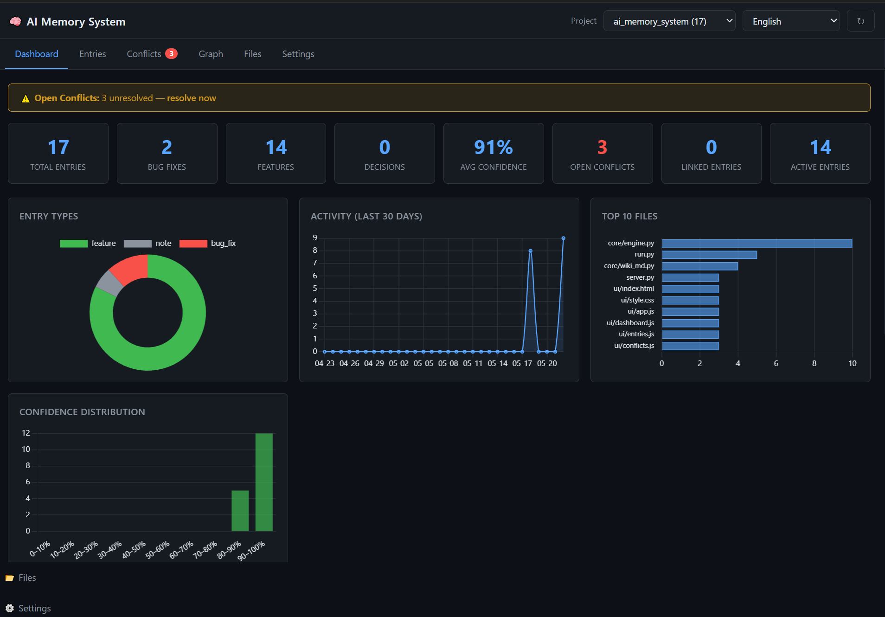

# AI Memory System

## Why does this exist?

AI agents start every new chat session with a **blank slate** — no memory of decisions made before, bugs already fixed, or why the code looks the way it does. When tackling a new problem, they routinely break solutions that were carefully built in previous sessions.

**AI Memory System** was created to solve exactly that:

| Problem | Solution |
|---|---|
| Every new chat forgets everything | Full project memory is injected into every new agent session automatically |
| Agents break existing solutions | Each change is stored with cause, fix, and links to related changes — agents see the full picture |
| Git log only shows *what* changed | The system records *why* it changed, *what problem* it solved, and *how it connects* to other decisions |
| Contradictions go unnoticed | Past and present changes are compared; conflicts are detected and surfaced for resolution |

---



A self-contained, **local** persistent memory engine for software projects, built for VS Code + GitHub Copilot Agent workflows.

It **remembers decisions, tracks bugs and features, detects contradictions** between historical entries, renders a structured Markdown wiki, visualises dependency graphs, and automatically feeds that knowledge back into every Copilot Agent session via VS Code hooks so the agent always has full project context without any manual `#file` references.

---

## How It Works

```
┌─────────────────────────────────────────────────────────────┐
│  VS Code  (Agent mode)                                      │
│                                                             │
│  SessionStart hook ──► context_injector.py                  │
│      └─ injects project memory summary as systemMessage     │
│                                                             │
│  Agent edits a file                                         │
│  PostToolUse hook  ──► hook_handler.py                      │
│      └─ auto-saves entry to memory + re-renders wiki        │
│                                                             │
│  copilot-instructions.md                                    │
│      └─ tells agent to run add_memory after every edit      │
└─────────────────────────────────────────────────────────────┘
         ▼
   data/projects/<name>/memory.json   (per-project, isolated)
   data/projects/<name>/wiki/         (Markdown wiki)
```

One installation at `C:\ai_memory_system` serves **all** your projects — each with isolated data under `data/projects/<name>/`.

## Features

- **SessionStart hook** — injects full project memory into every Copilot Agent session automatically
- **PostToolUse hook** — deterministically records a memory entry after every file write
- **Append-first storage** — historical entries are never silently overwritten
- **Atomic JSON writes** with automatic backup before overwrite
- **Conflict detection + resolution** — semantic similarity + heuristics; `supersede`, `merge`, `dismiss` actions with full audit trail; hot-file discount suppresses false positives on frequently-edited files
- **Orphan healing** — entries stuck in `conflict` status but with no matching conflict record are automatically restored to `active`
- **Revert detection** — identifies repeated revert patterns; newly `unstable`-tagged entries receive a `×0.85` confidence penalty (floor `0.40`)
- **Confidence decay** — time-based decay (configurable half-life) with preview mode; auto-scheduled once per day via the `add_memory` hook
- **Semantic deduplication** — near-duplicate detection and merge with threshold control
- **Dependency graph** — `depends_on` / `required_by` links; cycle detection; semantic link suggestions
- **Auto-tagging** — keywords in `description`/`cause`/`fix` are matched against a configurable tag dictionary and applied automatically on `add_memory`
- **Auto conflict scan** — `detect_conflicts()` runs automatically every 15 active entries
- **Wiki dirty-check** — `render_wiki` is a no-op when no entries have changed since the last render
- **Auto file summaries** — per-file digest regenerated on every `add_memory`
- **Test-ID links** — attach test identifiers to entries; warns when superseded entries have linked tests
- **Git stale check** — cross-checks entries against git history to flag outdated knowledge
- **Markdown wiki** auto-rendered with Obsidian-friendly `[[wikilinks]]`: by type, file, status
- **HTML dashboard** — local web UI with charts, vis.js dependency graph, settings form, operations panel, i18n (EN/UK)
- **Activity log** — every change timestamped with action and reason
- **Learner** — analyses Copilot chat logs, extracts patterns, updates all managed project instructions
- **Daemon** — background file watcher for non-agent edits (fallback)
- **Multi-project** — `--project name` flag isolates data per project
- **Offline-first embeddings** — uses `sentence-transformers` when installed, falls back to a deterministic local hasher

---

## Requirements

- Python 3.10+
- No mandatory third-party dependencies (pure stdlib for core functionality)

**Optional** (recommended):

```
pip install sentence-transformers   # higher-quality semantic similarity
pip install watchdog                # efficient file watching (daemon mode)
```

---

## Installation

```powershell
git clone https://github.com/your-username/ai-memory-system.git C:\ai_memory_system
cd C:\ai_memory_system

# (Optional) create venv
python -m venv .venv ; .venv\Scripts\Activate.ps1

# Bootstrap: creates data/ files
python bootstrap.py
```

---

## Quickstart — Memory CLI (`run.py`)

```powershell
# Add a memory entry with dependency and test links
python run.py --project my_app add_memory `
  --type bug_fix `
  --description "Login crashes on empty password" `
  --cause "Missing null-check before bcrypt call" `
  --fix "Added validation in auth.py line 42" `
  --files src/auth.py `
  --confidence 0.9 `
  --tags backend auth `
  --depends-on <prior_decision_id> `
  --test-ids test_login_empty_password

# Semantic search
python run.py --project my_app query_memory "authentication bug"

# Resolve a conflict
python run.py --project my_app resolve_conflict `
  --id <conflict_id> --action supersede_a --reason "B is correct"

# Dependency graph
python run.py --project my_app add_link --from-id <id1> --to-id <id2>
python run.py --project my_app get_dependencies --id <id> --depth 2
python run.py --project my_app suggest_links --id <id> --threshold 0.75

# Maintenance
python run.py --project my_app decay --dry-run
python run.py --project my_app deduplicate --dry-run
python run.py --project my_app check_stale --repo-path C:\Projects\MyApp
python run.py --project my_app render_wiki
python run.py --project my_app lint
```

> Omit `--project` to use the default shared store (`data/`).

### All `run.py` commands

| Command | Description |
|---|---|
| `add_memory` | Add entry (`--type`, `--description`, `--cause`, `--fix`, `--files`, `--confidence`, `--tags`, `--depends-on`, `--test-ids`) |
| `list_memory` | List entries (filter: `--type`, `--status`) |
| `query_memory` | Top-k semantic search |
| `update_status` | Change entry status (logged) |
| `update_confidence` | Change entry confidence (logged) |
| `detect_conflicts` | Full conflict re-scan |
| `resolve_conflict` | Resolve conflict: `--id`, `--action supersede_a\|supersede_b\|merge\|dismiss`, `--reason` |
| `decay` | Apply time-based confidence decay (`--half-life-days`, `--min-confidence`, `--dry-run` / `--apply`) |
| `deduplicate` | Find and merge near-duplicates (`--threshold`, `--dry-run` / `--apply`) |
| `add_link` | Create a `depends_on` link (`--from-id`, `--to-id`) |
| `remove_link` | Remove a dependency link |
| `get_dependencies` | Show transitive dependencies (`--id`, `--depth`) |
| `suggest_links` | Suggest links by semantic similarity (`--id`, `--threshold`, `--top-k`) |
| `summarize_file` | Print auto-generated file summary |
| `check_stale` | Cross-check against git history (`--repo-path`, `--min-age-days`, `--dry-run` / `--apply`) |
| `render_wiki` | Render Markdown wiki under `data/…/wiki/` |
| `lint` | 7 health checks: stale, low-confidence, orphans, duplicates… |
| `state` | Entry count, conflicts, wiki, embedding backend |

---

## HTML Dashboard — `server.py`

A lightweight single-page web UI served entirely on localhost — no npm, no build step.

```powershell
python server.py --project piobmasterpro
# opens http://localhost:5001 automatically

python server.py --project my_app --port 8080 --no-browser
```

### Tabs

| Tab | Contents |
|---|---|
| **Dashboard** | KPI cards, 6 Chart.js charts (types, activity timeline, top files, confidence histogram, top tags, status breakdown) |
| **Entries** | Filterable/searchable table with expandable detail panel, inline status & confidence editing, tag management |
| **Conflicts** | Side-by-side conflict cards with action buttons and reason dialog |
| **Graph** | vis.js dependency graph — node colour by type, size by confidence, filter controls, suggest-links |
| **Files** | File list with entry-count badges; click → auto-summary + entries |
| **Settings** | Full settings form + Operations panel (decay, deduplication, render wiki, lint) |

Language switcher (EN / UK) in the top-right corner — strings sourced from `ui/translations.js`.

---

## VS Code + Copilot Integration (`run_infra.py`)

### 1. Scaffold a project

```powershell
python run_infra.py setup C:\Projects\MyApp `
  --language python `
  --framework django
```

Creates inside `C:\Projects\MyApp`:
```
.github/
  copilot-instructions.md   ← project standards + Agent Workflow section
  hooks/
    memory.json             ← SessionStart + PostToolUse hooks
  prompts/
    record-memory.prompt.md ← /record-memory slash-command
.vscode/
  settings.json
  extensions.json
```

### 2. The hooks (automatic, zero-effort)

**`SessionStart`** → `core/context_injector.py`

At the start of every agent session, the agent receives:
```
## Project Memory — my_app  (2026-04-28 17:31 UTC)
### Recent Active Entries (5 total)
- [abc12345] (bug_fix, conf=0.90) Login crashes on empty password → src/auth.py [2026-04-10]
### Open Conflicts (1)
- abc12345 ↔ def67890  sim=0.92  duplicate unresolved issue
### Stats  total=12  bug_fix=4  feature=5  decision=3
```

**`PostToolUse`** → `core/hook_handler.py`

After every file write the agent makes, a memory entry is automatically created:
```
[memory:my_app] ✅ a1b2c3d4 (feature) — Add login endpoint
```

### 3. Scan & learn from Copilot activity

```powershell
# One-shot scan of VS Code Copilot debug logs
python run_infra.py scan

# Watch continuously (5-second interval)
python run_infra.py watch --interval 5

# Analyse activity and update all managed project instructions
python run_infra.py learn

# Show system status
python run_infra.py status
```

### 4. Background daemon (non-agent edits)

```powershell
# Watch specific projects for file changes and auto-create memory entries
python run_infra.py daemon --projects C:\Projects\MyApp C:\Projects\OtherApp
```

---

## Folder Structure

```
ai_memory_system/
├── core/
│   ├── engine.py             # single gateway — all memory operations
│   ├── storage.py            # atomic JSON I/O + backups
│   ├── models.py             # MemoryEntry, ConflictRecord (depends_on, test_ids fields)
│   ├── conflict.py           # conflict detection rules + hot-file discount
│   ├── conflict_resolver.py  # supersede / merge / dismiss actions
│   ├── revert_detector.py    # revert pattern detection + confidence penalty
│   ├── decay.py              # time-based confidence decay
│   ├── deduplicator.py       # near-duplicate detection and merge
│   ├── dependency_graph.py   # depends_on graph — add/remove/query/suggest
│   ├── summarizer.py         # per-file auto summary generation
│   ├── git_inspector.py      # git stale check via subprocess
│   ├── embeddings.py         # sentence-transformers + deterministic fallback
│   ├── updater.py            # controlled merge & wiki rebuild
│   ├── wiki_md.py            # Markdown wiki renderer (Obsidian wikilinks)
│   ├── lint.py               # 7 health checks
│   ├── vscode_infra.py       # scaffolds .github/ in any project
│   ├── copilot_logger.py     # reads VS Code Copilot debug logs
│   ├── learner.py            # extracts patterns, updates instructions
│   ├── auto_memory.py        # correlates file changes + Copilot events
│   ├── watcher.py            # file watcher daemon (watchdog / polling)
│   ├── hook_handler.py       # PostToolUse hook — auto memory recording
│   └── context_injector.py   # SessionStart hook — memory context injection
├── ui/                       # HTML dashboard (served by server.py)
│   ├── index.html
│   ├── style.css
│   ├── app.js                # state, API wrapper, tab routing, toasts
│   ├── dashboard.js          # KPI cards + Chart.js charts
│   ├── entries.js            # filterable entry table + detail panel
│   ├── conflicts.js          # conflict cards + resolution actions
│   ├── graph.js              # vis.js dependency graph
│   ├── filebrowser.js        # file list + auto-summary view
│   ├── settings.js           # settings form + operations panel
│   └── translations.js       # EN/UK i18n strings
├── docs/
│   └── screenshot.png        # dashboard screenshot
├── data/                     # ← gitignored; created by bootstrap.py
│   ├── .gitkeep
│   └── projects/             # per-project isolated stores
│       └── <name>/
│           ├── memory.json
│           ├── conflicts.json
│           ├── activity_log.json
│           ├── file_summaries.json
│           ├── settings.json
│           └── wiki/
├── templates/
│   └── copilot_instructions.md.tpl
├── .github/
│   ├── copilot-instructions.md
│   ├── hooks/
│   │   └── memory.json       # SessionStart + PostToolUse hooks
│   └── prompts/
│       └── record-memory.prompt.md
├── tests/
│   ├── test_conflict_resolver.py
│   ├── test_decay.py
│   ├── test_deduplicator.py
│   └── test_revert_detector.py
├── bootstrap.py              # one-time setup: creates data/ structure
├── run.py                    # memory CLI
├── run_infra.py              # VS Code / Copilot infra CLI
└── server.py                 # local HTML dashboard server
```

---

## Memory Entry Schema

```json
{
  "id":             "abc123def456",
  "type":           "bug_fix | feature | note | decision",
  "description":    "string (required)",
  "cause":          "what triggered the change",
  "fix":            "what exactly changed and where",
  "decisions":      ["list of key decisions made"],
  "files":          ["relative/path/to/file.py"],
  "status":         "active | resolved | superseded | conflict",
  "confidence":     0.9,
  "timestamp":      "2026-05-18T10:00:00+00:00",
  "depends_on":     ["other_entry_id"],
  "required_by":    ["other_entry_id"],
  "test_ids":       ["test_my_feature"],
  "conflicts_with": ["other_entry_id"],
  "tags":           ["agent", "auto", "project:my_app"]
}
```

---

## Update Policy

| Allowed | Not Allowed |
|---|---|
| Add new entries | Delete historical entries |
| Update `status`, `confidence` | Silent rewrite of past memory |
| Mark conflicts (append-only) | Modifications outside `MemoryEngine` |

Every change is recorded in `activity_log.json` with timestamp, action, affected IDs, and reason.

---

## Programmatic Use

```python
from core.engine import MemoryEngine

engine = MemoryEngine("data/projects/my_app")

# Add an entry with a dependency link and test ID
result = engine.add_memory({
    "type":        "decision",
    "description": "Use PostgreSQL for primary store",
    "fix":         "Added pg driver and migrations",
    "files":       ["db/migrations/0001.sql"],
    "confidence":  0.95,
    "depends_on":  ["<prior_schema_entry_id>"],
    "test_ids":    ["test_db_connection"],
})
# result["entry"]           → the saved entry
# result["conflicts"]       → any conflicts detected
# result["created_links"]   → dependency links created
# result["suggested_links"] → similar entries worth linking

# Conflict resolution
engine.resolve_conflict(conflict_id, action="supersede_a", reason="B is the correct fix")

# Dependency graph
engine.add_dependency_link(from_id, to_id)
engine.get_dependencies(entry_id, depth=2)
engine.suggest_links(entry_id, threshold=0.75, top_k=5)

# Maintenance operations
engine.decay(dry_run=True, half_life_days=60, min_confidence=0.4)
engine.deduplicate(dry_run=True, threshold=0.88)
engine.check_stale(repo_path="C:/Projects/MyApp", min_age_days=7)
engine.render_wiki_md()
```

---

## Українська (Ukrainian)

### Огляд (Overview)

**AI Memory System** — локальний рушій персистентної пам'яті для програмних проектів. Система запам'ятовує рішення, отримує записи про помилки та функції, виявляє суперечності та автоматично надає повний контекст проекту кожній сесії GitHub Copilot Agent в VS Code.
---
## Навіщо це потрібно?

AI-агенти починають кожну нову сесію з **чистого аркуша** — без жодної пам'яті про попередні рішення, виправлені баги чи причини, чому код виглядає саме так. Вирішуючи нову задачу, агенти регулярно ламають рішення, які були ретельно побудовані в попередніх сесіях.

**AI Memory System** була створена саме для того, щоб це виправити:

| Проблема | Рішення |
|---|---|
| Кожен новий чат все забуває | Повна пам'ять проєкту автоматично вставляється в кожну нову сесію агента |
| Агенти ламають існуючі рішення | Кожна зміна зберігається з причиною, виправленням та зв'язками з іншими змінами |
| Git log показує лише *що* змінилось | Система зберігає *чому* змінилось, *яку проблему* вирішувало і *як пов'язане* з іншими рішеннями |
| Суперечності між змінами залишаються непоміченими | Минулі та поточні зміни порівнюються; конфлікти виявляються і виводяться для вирішення |
---

### Ключові можливості (Key Features)

- **SessionStart hook** — інжектує повну пам'ять проекту в кожну сесію GitHub Copilot Agent автоматично
- **PostToolUse hook** — детерміністично записує запис пам'яті після кожного запису файлу
- **Append-first storage** — історичні записи ніколи не перезаписуються мовчки
- **Атомарні JSON записи** з автоматичним резервним копіюванням перед перезаписом
- **Виявлення та розв'язання конфліктів** — семантична схожість + евристики; знижка для "гарячих" файлів (частих файлів); дії `supersede`, `merge`, `dismiss` з повною аудит-стежкою
- **Зцілення сиріт** — записи зі статусом `conflict` без відповідного запису конфлікту автоматично відновлюються до `active`
- **Виявлення повернень** — ідентифікує повторювані паттерни; новоозначені `unstable` записи отримують штраф `×0.85` до впевненості (мінімум `0.40`)
- **Розпад впевненості** — часовий розпад з режимом попереднього перегляду; автоматичне планування раз на день через хук `add_memory`
- **Семантична дедублікація** — виявлення та об'єднання майже-дублів з контролем порогу
- **Автоматичне тегування** — ключові слова з `description`/`cause`/`fix` зіставляються зі словником тегів і застосовуються автоматично
- **Авто-сканування конфліктів** — `detect_conflicts()` запускається автоматично кожні 15 активних записів
- **Перевірка оновленості вікі** — `render_wiki` пропускається, якщо з часу останнього рендеру нічого не змінилось
- **Граф залежностей** — посилання `depends_on` / `required_by`; виявлення циклів; пропозиції семантичних посилань
- **Автоматичні резюме файлів** — резюме для кожного файлу, перегенероване при кожному `add_memory`
- **Посилання на ідентифікатори тестів** — прикріпити ідентифікатори тестів до записів; попередження при заміщенні
- **Перевірка застарілості Git** — крос-перевірка записів з історією git для позначення застарілих знань
- **Вікі Markdown** — автоматично відтворена з Obsidian-friendly `[[wikilinks]]`
- **HTML дашбоард** — локальний веб-інтерфейс з діаграмами, графом залежностей vis.js, формою параметрів, панеллю операцій, підтримкою EN/UK
- **Журнал діяльності** — кожна зміна з часовою міткою, дією та причиною
- **Учень** — аналізує журнали чату Copilot, розпізнає паттерни, оновлює інструкції всіх керованих проектів
- **Демон** — фоновий спостерігач файлів для редагувань не агентом (резервний варіант)
- **Багатопроектність** — прапор `--project name` ізолює дані за проектом
- **Вбудування offline-first** — використовує `sentence-transformers` коли встановлено, падає назад на детермінований локальний хешер

### Встановлення (Installation)

```bash
git clone https://github.com/your-org/ai_memory_system.git C:\ai_memory_system
cd C:\ai_memory_system
python bootstrap.py
```

### Швидкий старт (Quickstart)

```bash
# Додати запис до проекту
python run.py --project my_app add_memory \
  --type decision \
  --description "Обрано PostgreSQL для основного сховища" \
  --cause "Потреба в надійності та масштабованості" \
  --files "db/migrations/0001.sql"

# Список всіх конфліктів
python run.py --project my_app list_conflicts

# Розв'язання конфлікту
python run.py --project my_app resolve_conflict <conflict_id> \
  --action supersede_a \
  --reason "Варіант A — правильне рішення"

# Здійснити розпад впевненості (попередній перегляд)
python run.py --project my_app decay --dry-run --half-life-days 60

# Лінеаризація дашбоарду
python server.py  # запуск на localhost:5001
```

### Локальне зберігання даних (Local Storage)

Кожен проект зберігає свої дані ізольовано в `data/projects/<name>/`:

```
data/projects/my_app/
├── memory.json           # всі записи
├── conflicts.json        # виявлені конфлікти
├── activity_log.json     # аудит кожної зміни
├── file_summaries.json   # резюме кожного файлу
├── settings.json         # параметри системи
└── wiki/                 # генеровані сторінки Markdown
    ├── index.md
    ├── by_type/
    ├── by_file/
    └── entries/
```

### Схема запису пам'яті (Entry Schema)

```json
{
  "id":             "abc123def456",
  "type":           "bug_fix | feature | note | decision",
  "description":    "обов'язковий текст",
  "cause":          "що спричинило зміну",
  "fix":            "що саме змінилось та де",
  "files":          ["відносна/стежка/до/файлу.py"],
  "status":         "active | resolved | superseded",
  "confidence":     0.9,
  "timestamp":      "2026-05-18T10:00:00+00:00",
  "depends_on":     ["інший_id_запису"],
  "test_ids":       ["test_мої_функції"],
  "tags":           ["agent", "auto"]
}
```

### Команди CLI (CLI Commands)

```bash
# Керування записами
python run.py --project <name> add_memory        # додати запис
python run.py --project <name> list_entries      # список записів
python run.py --project <name> list_conflicts    # список конфліктів

# Граф залежностей
python run.py --project <name> add_link <from_id> <to_id>
python run.py --project <name> get_dependencies <id>
python run.py --project <name> suggest_links <id>

# Операції обслуговування
python run.py --project <name> decay             # розпад впевненості
python run.py --project <name> deduplicate       # виявити дублі
python run.py --project <name> render_wiki       # регенерувати вікі

# Git перевірка
python run.py --project <name> check_stale --repo-path /path/to/repo

# Налаштування
python run.py --project <name> list_settings     # показати параметри
```

### Дашбоард (HTML Dashboard)

Запустіть `python server.py` на `localhost:5001` для доступу до веб-інтерфейсу:

- **Dashboard** — KPI карточки та 6 діаграм (типи, часова лінія, файли, впевненість, теги, статус)
- **Entries** — таблиця записів з фільтруванням та деталями редагування
- **Conflicts** — карточки конфліктів з діями дозволу конфліктів
- **Graph** — інтерактивна візуалізація графу залежностей (vis.js)
- **Files** — список файлів з резюме та записами на файл
- **Settings** — форма параметрів + панель операцій (decay, deduplicate, render_wiki)

### Інтеграція VS Code (VS Code Integration)

Файл `copilot-instructions.md` в проекті автоматично інструктує агента:

```markdown
## Memory Recording

After editing a file, run:

python run.py --project <project_name> add_memory \
  --type <bug_fix|feature|note|decision> \
  --description "<one sentence: what was done>" \
  --files <space-separated relative paths>
```

При запуску SessionStart hook автоматично інжектує повне резюме пам'яті проекту як systemMessage.

### Ліцензія (License)

MIT
